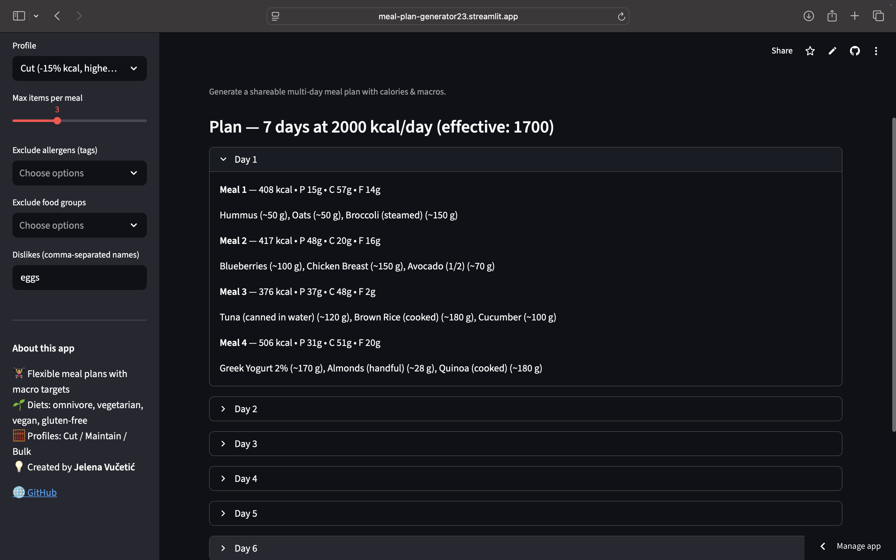

# 🥗 JV Fit — Meal Plan Generator

Personalized nutrition plans by **Jelena Vučetić**.
Generate shareable multi-day meal plans with calorie and macro targets.

[](https://meal-plan-generator23.streamlit.app)
[](https://www.python.org/)

---

## ✨ Features

- 🇬🇧 / 🇷🇸 Language switch (EN / SR)
- Profiles: **Cut / Maintain / Bulk** (auto-adjust kcal and macros)
- Allergens & dislikes filtering (by tags, groups, or ingredient names)
- 1–14 day plans · 2–6 meals/day
- Single-file **HTML export** (easy to share)
- Clean, minimalist **JV Fit** branding

---

## 🧠 Tech Stack

**Python** · **Streamlit** · **JSON** · **HTML Export**

---

## 🚀 Live Demo

🎯 [Open the app on Streamlit Cloud](https://meal-plan-generator23.streamlit.app)

**https://meal-plan-generator23.streamlit.app**

---

## 🖼️ Preview



---

## 🛠️ Run Locally

```bash
# 1️⃣ Clone the repository
git clone https://github.com/vucko23/meal-plan-mini-app.git
cd meal-plan-mini-app

# 2️⃣ Create and activate virtual environment
python3 -m venv .venv
source .venv/bin/activate   # Windows: .venv\Scripts\activate

# 3️⃣ Install dependencies
pip install -r requirements.txt

# 4️⃣ Run the app
streamlit run app.py
```


## 📤 Deploy to Streamlit Cloud

1. Push this folder to** ****GitHub**
2. Go to** **[https://share.streamlit.io](https://share.streamlit.io/)
3. Click** ****New app → Select your repo → app.py**
4. Streamlit builds automatically and provides your live public URL

## 🔗 Custom Subdomain

On Streamlit Cloud:
**Manage app → Settings → Advanced → Custom subdomain**

## 👩‍💻 Author

**Jelena Vučetić**
🏀 Former pro athlete · 🎓 Python & AI Developer
📍 Based in Montenegro

* [🌐 GitHub](https://github.com/vucko23)
