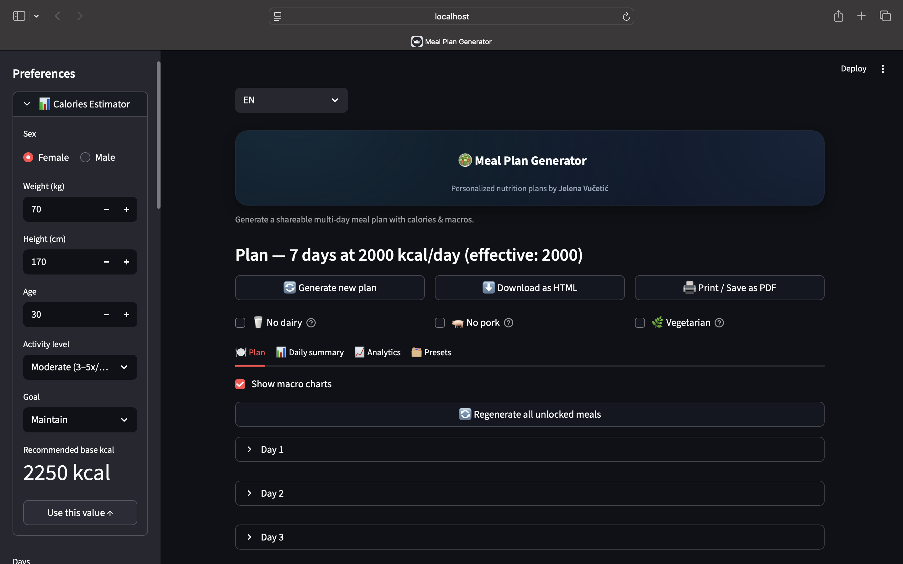
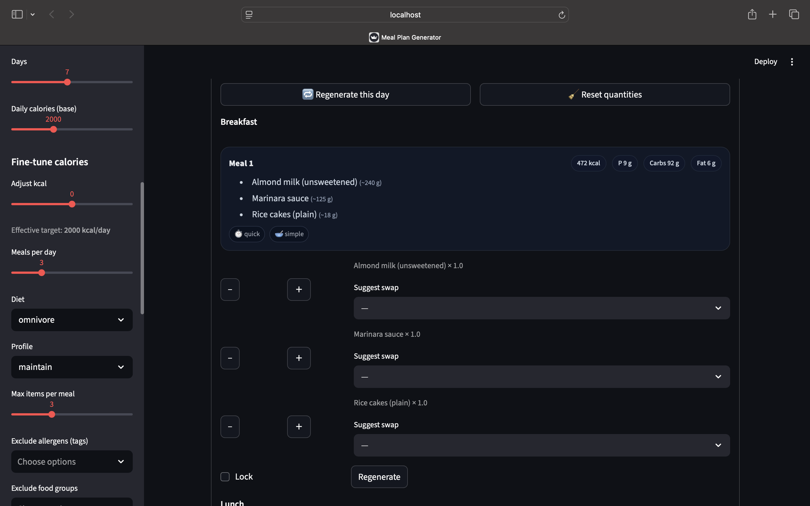
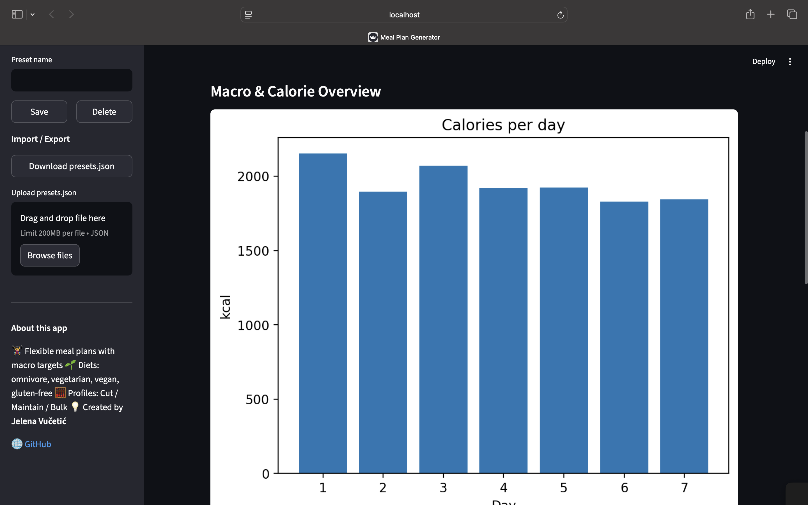
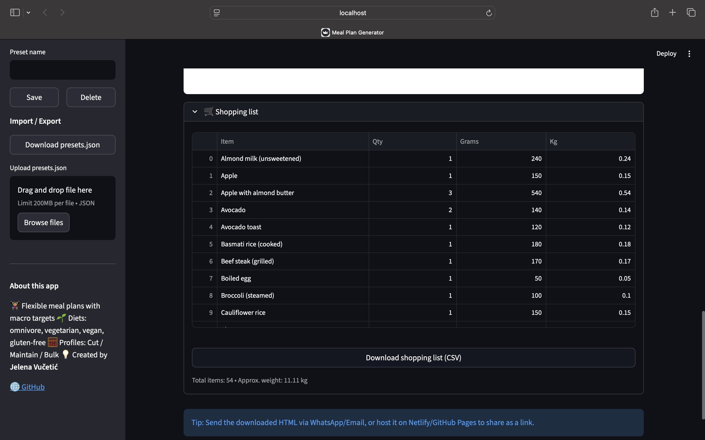

# 🥗 Meal Plan Generator

[](https://meal-plan-generator23.streamlit.app)

[](https://www.python.org/)
[](https://streamlit.io/)
[](LICENSE)
[](#)

A modern, dark-themed **Streamlit app** for generating personalized meal plans with calories and macros — built by **Jelena Vučetić**.

---

## ✨ Features

- 📅 Generate **multi-day meal plans**
- 🍽 Control **quantities per meal** (`+` / `−`)
- 🔁 **Regenerate meals/days** individually
- 🔒 **Lock** meals you want to keep
- 🧠 **Smart macro summary** with tips (EN/SR)
- 📊 **Daily & overall macro summaries** with optional donut chart
- 🧾 Export to **HTML / PDF / CSV**
- 🌿 Quick filters: *No dairy*, *No pork*, *Vegetarian*
- 🧮 Analytics & daily kcal trend chart
- 🛒 Automatic **shopping list generator**

---

## 🖼 Preview

### 🏠 Main view



### 🍽 Daily view



### 📈 Analytics tab



### 🛒 Shopping list



---

## 🚀 Run locally

```bash
# 1️⃣ Clone the repo
git clone https://github.com/vucko23/meal-plan-mini-app.git
cd meal-plan-generator

# 2️⃣ Create & activate venv
python3 -m venv .venv
source .venv/bin/activate  # Windows: .venv\Scripts\activate

# 3️⃣ Install dependencies
pip install -r requirements.txt

# 4️⃣ Run the app
streamlit run app.py
```

The app will open automatically at
👉 **http://localhost:8501**

---

## 🧩 Project structure

```
meal-plan-generator/
├── app.py
├── requirements.txt
├── .gitignore
├── LICENSE
├── assets/
│   ├── mealplan_home.png
│   ├── day_view.png
│   ├── analytics_tab.png
│   └── shooping_list.png
└── data/
    └── profiles.json
```

---

## 🧠 Tech stack

- **Streamlit** – UI framework
- **Pandas** – table operations, CSV export
- **Matplotlib** – charts and macro summaries
- **Python 3.10–3.13**

---

## 🗣 Languages

Interface available in:

- 🇬🇧 English
- 🇷🇸 Serbian

---

## 📝 License

This project is licensed under the **MIT License** — see the [LICENSE](LICENSE) file for details.

---

Made with ❤️ by **Jelena Vučetić**
